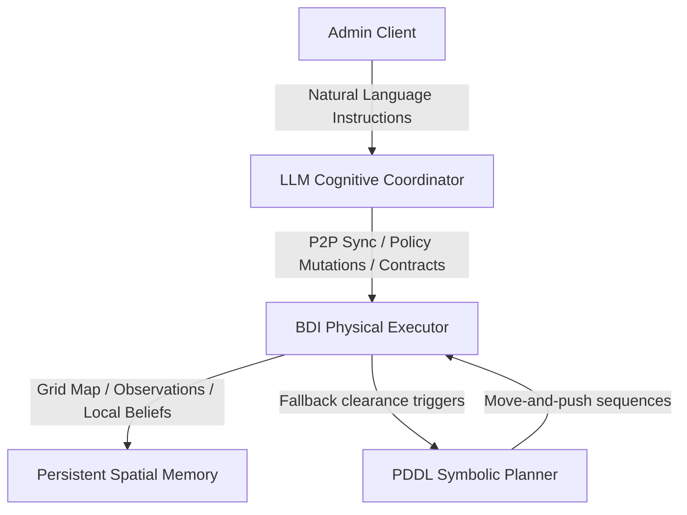

# ASA Autobots: Cooperative Multi-Agent Deliveroo System

[](#command-line-interface)
[](#command-line-interface)
[](https://nodejs.org)
[](https://opensource.org/licenses/ISC)

This repository contains the implementation, test suites, and documentation for a cooperative multi-agent delivery system designed for the Deliveroo competitive simulator. The project demonstrates hybrid planning, combining reactive agents, cognitive LLM-based coordination, and STRIPS PDDL symbolic path clearance.

---

## System Architecture

The cooperative system consists of two primary autonomous agents operating in sync to maximize delivery efficiency under dynamic policy rules:



### 1. BDI Physical Executor (Agent 1)
* **Execution Paradigm**: Driven by a Belief-Desire-Intention (BDI) control loop.
* **Spatial Memory**: Maintains persistent grid representations with negative inference (removing stale objects) and local parcel value decay simulation.
* **Goal Selection**: Structured utility cascade prioritizing administrative commands, cooperative contract execution, and expiration-aware economic utilities.
* **Delivery Stack Optimization**: Solves cargo subset optimization and wait-time bounds using dynamic programming to maximize policy-adjusted returns.
* **Safety & Navigation**: Deadlock prevention via deterministic peer yielding and pathfinding with configurable obstacle routing.

### 2. LLM Cognitive Coordinator (Agent 2)
* **Cognitive Reasoning**: Powered by a large language model (`llama-3.3-70b`) to translate high-level administrative tasks.
* **Decomposition**: Translates complex instructions into discrete sequential actions, checks task feasibility via arithmetic constraints, and verifies positive reward payouts.
* **Belief & Policy Control**: Dynamically modifies active agent rules, synchronizes coordinate goals, and delegates relay contracts via Peer-to-Peer messaging.

### 3. PDDL Symbolic Planner
* **Domain Clearance**: Implements a symbolic planner utilizing a STRIPS PDDL domain definition (`deliveroo-crates`).
* **Fallback Strategy**: Triggered when pathways are obstructed by pushable crates, computing optimal push sequences to clear delivery corridors.

---

## Repository Structure & Module Mapping

To assist automated evaluators and LLM grading agents, the core modules of the project are organized as follows:

* **[src/agent/BeliefBase.js](file:///home/xupremix/Desktop/ASA_LAB/asa-autobots/src/agent/BeliefBase.js)**: Manages local memory representation (beliefs), handles negative inference of observed objects, and simulates parcel value decay over time.
* **[src/agent/GoalSelector.js](file:///home/xupremix/Desktop/ASA_LAB/asa-autobots/src/agent/GoalSelector.js)**: Runs utility calculations to select the best active goal (e.g., pickups, deliveries, patrolling).
* **[src/agent/Intentions.js](file:///home/xupremix/Desktop/ASA_LAB/asa-autobots/src/agent/Intentions.js)**: Implements the generator-based BDI action selection and preemption queues.
* **[src/agent/ActionDispatcher.js](file:///home/xupremix/Desktop/ASA_LAB/asa-autobots/src/agent/ActionDispatcher.js)**: Dispatches BDI actions to the Deliveroo socket events interface.
* **[src/policy/PolicyEngine.js](file:///home/xupremix/Desktop/ASA_LAB/asa-autobots/src/policy/PolicyEngine.js)**: Evaluates dynamic policy rules and mathematical expression conditions.
* **[src/policy/DeliveryOptimizer.js](file:///home/xupremix/Desktop/ASA_LAB/asa-autobots/src/policy/DeliveryOptimizer.js)**: Combinatorial optimizer that calculates optimal cargo sub-selections and wait-time bounds.
* **[src/planning/PddlServiceBridge.js](file:///home/xupremix/Desktop/ASA_LAB/asa-autobots/src/planning/PddlServiceBridge.js)**: Bridges the agent with an external PDDL solver to generate crate-clearing action paths.
* **[src/llm/LLMCoordinator.js](file:///home/xupremix/Desktop/ASA_LAB/asa-autobots/src/llm/LLMCoordinator.js)**: Handles prompt compilation, structured tool execution loops, and status feedback.

---

## Getting Started

### 1. Prerequisites
* **Node.js**: Version 24.0 or higher is required.
* **PDDL Solver**: Local solver running on `http://localhost:5001` (required for crate-clearing capabilities).
* **LM Studio / OpenAI-Compatible Endpoint**: Running `llama-3.3-70b` or equivalent LLM for the coordinator.

### 2. Dependency Installation
Initialize the workspace and install direct runtime dependencies by executing:
```bash
npm install
```

### 3. Configuration
Duplicate the provided `.env.example` template to `.env` in the project root:
```bash
cp .env.example .env
```
Configure the environment variables, including socket server URLs, agent tokens, and LLM endpoint specifications.

---

## Command Line Interface

Execute the agent pipelines and evaluation benchmarks via the following scripts:

### Agent Execution
* **Run BDI Executor**:
  ```bash
  npm run bdi
  ```
* **Run LLM Coordinator**:
  ```bash
  npm run llm
  ```

### Verification and Benchmarks
* **Run Automated Tests**:
  Runs the unit and integration test suite covering pathfinding, BDI decision logic, and policy evaluation:
  ```bash
  npm test
  ```
* **Run Test Coverage**:
  Generates a detailed test coverage report using Node's experimental native coverage reporter:
  ```bash
  npm run test:coverage
  ```
  *(Current test suite yields **~91.5%** line coverage across the codebase).*
* **Run Performance Benchmark**:
  Deploys concurrent agents for a limited duration to generate performance metrics (movement counts, successful pickups, dropped cargo, and collision rates):
  ```bash
  npm run benchmark
  ```

