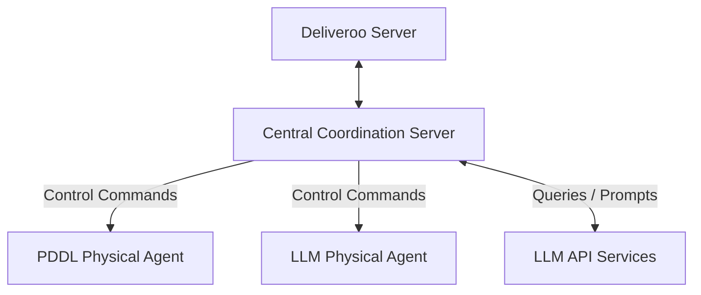
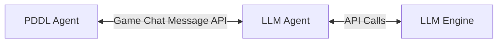
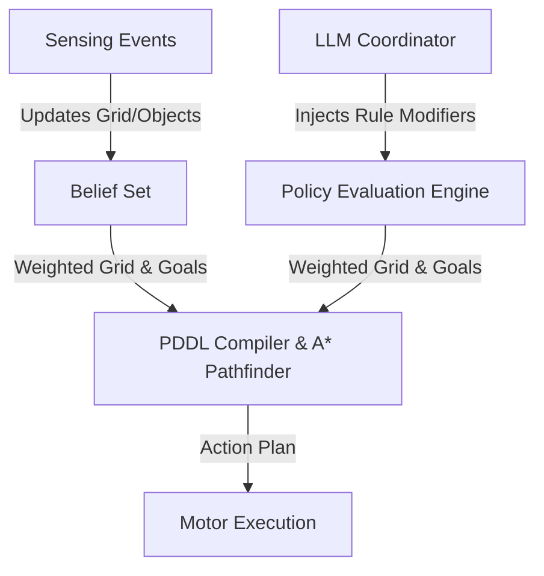

# Requirements and Design Specification: Overhauled Deliveroo Multi-Agent System

This document outlines the goals, requirements, architectural options, agent designs, tool interfaces, and PDDL modeling specs for the overhauled `asa-autobots` multi-agent coordination system. It represents the problem domain starting from first-principles design.

---

## 1. Project Overview & Strategic Goals

The goal of this project is to build a highly cooperative, hybrid multi-agent delivery team operating inside the **Deliveroo** grid-world environment. 

The environment features:
- A spatial grid with obstacles, spawn zones, and delivery zones.
- Moving packages (parcels) with varying points, spawn rates, and decay rates.
- Impeding obstacles (crates) that block pathing but can be pushed.
- Two distinct agents that must collaborate to maximize cumulative team scores while meeting external constraints, solving math challenges, and respecting dynamic rules.

### The Hybrid Agent Paradigm
We divide cognitive and physical responsibilities between two agents with distinct reasoning profiles:
1. **Agent 1: PDDL Agent (The Planner)**
   - **Characteristics**: Fast, deterministic, and symbolic. 
   - **Role**: Compiles local spatial surroundings (obstacles, crates, packages) into a symbolic state representation, runs an automated planner (via PDDL solver), and executes actions (movement, picking up, delivery, pushing crates).
   - **Constraint**: Cannot access the LLM; acts purely on symbolic facts and local sensory inputs.
2. **Agent 2: LLM Agent (The Coordinator)**
   - **Characteristics**: Flexible, cognitive, and communicative.
   - **Role**: Interacts with the human/admin client, evaluates mathematical query strings, parses fuzzy instructions, modifies behavioral policy filters, and coordinates collaborative plans with Agent 1.
   - **Capabilities**: Can call tools, query LLM backend models, and reason using natural language.

---

## 2. LLM System Prompt Design

To guarantee robust operation and limit non-deterministic completions, the LLM agent must be configured with a strict, instructions-first system prompt. Below is the proposed design for the LLM Coordinator's system prompt.

```markdown
You are the cognitive reasoning brain of a cooperative, autonomous Deliveroo multi-agent system.
Your team consists of:
1. Yourself (the LLM Agent - Coordinator)
2. A PDDL Agent (the Planner/Partner)

While you possess the reasoning engine, your partner agent executes physical actions under your high-level guidance or cooperates with you directly through a message-based communication scheme.

────────────────────────────────────────────────────────────────────────────────
CORE OPERATIONAL PROTOCOLS & GOALS
────────────────────────────────────────────────────────────────────────────────
1. MATH EVALUATION & PREPARATION
   - Before executing any navigation or cooperative command containing arithmetic expressions (e.g. "go to cell 4+2, 10-3"), you MUST call the "evaluate_math_expression" tool.
   - Wait for the mathematical result in the next turn, and only then use the evaluated numeric coordinates for routing or coordination.
   - If a query contains multiple calculations, call the evaluation tool in parallel.
   
2. GOAL FILTERING & FEASIBILITY
   - If a task offers a negative or zero reward, or the path is determined to be blocked, declare the task unfeasible. Do not waste agent resources on tasks with zero/negative reward utility.

3. COOPERATIVE EXECUTION (RENDEZVOUS & TRADING)
   - When coordinating a package handoff or gate clearance, establish a coordination contract.
   - Coordinate using specific, sequential states: PROPOSE, ACCEPT, READY, DROP, PICKUP, COMPLETE.
   - If you are carrying a package to trade, drop it at the rendezvous coordinate, move away, and signal your partner to step forward and retrieve it.

────────────────────────────────────────────────────────────────────────────────
RESPONSE FORMATTING LIMITS
────────────────────────────────────────────────────────────────────────────────
- When executing tools, output ONLY the tool calls.
- If asked a factual question by the admin, reply directly with the raw answer text. Avoid conversational preambles (e.g. output "4" instead of "The answer is 4").
- For multi-turn workflows where you are waiting for a tool result, output a status prefix like "[WAITING]" or "[REPLAN]" followed by a brief reason.
```

### Dynamic State Injections (User Prompt Design)
On every operational frame, the LLM is supplied with a serialized JSON view of the world. This user prompt is built dynamically and contains:
```json
{
  "self": {
    "id": "agent_llm_1",
    "x": 3,
    "y": 5,
    "score": 420,
    "carrying": ["parcel_id_9"]
  },
  "partner": {
    "id": "agent_pddl_1",
    "x": 5,
    "y": 6,
    "score": 380,
    "carrying": []
  },
  "visible_crates": [
    {"id": "crate_0", "x": 4, "y": 6}
  ],
  "visible_parcels": [
    {"id": "parcel_id_10", "x": 1, "y": 2, "reward": 15}
  ],
  "map_rules": {
    "avoid_tiles": ["4,5"],
    "crate_capable_tiles": ["1,1", "1,2", "4,6", "4,7", "5,6"]
  }
}
```

---

## 3. Tool Design & API Requirements

The LLM Agent uses function calling to translate cognitive choices into actions. Below are the JSON schema designs for these tools.

### 3.1. Evaluate Math Expression
- **Name**: `evaluate_math_expression`
- **Description**: Evaluates mathematical/arithmetic expressions (e.g., `'5 * 4'`, `'(12 - 2) / 2'`) before calling coordinates.
- **Parameters**:
  ```json
  {
    "type": "object",
    "properties": {
      "expression": {
        "type": "string",
        "description": "The math expression string to evaluate."
      }
    },
    "required": ["expression"]
  }
  ```

### 3.2. Move Agent to Coordinate
- **Name**: `move_agent_to_coordinate`
- **Description**: Directs an agent to navigate immediately to target coordinates.
- **Parameters**:
  ```json
  {
    "type": "object",
    "properties": {
      "agentId": {
        "type": "string",
        "description": "The unique ID of the agent to move (self or partner)."
      },
      "x": { "type": "number" },
      "y": { "type": "number" }
    },
    "required": ["agentId", "x", "y"]
  }
  ```

### 3.3. Apply Agent Rules (Policy Modifiers)
- **Name**: `apply_agent_rules`
- **Description**: Updates environmental policy rules (avoid tiles, score minimums) for an agent.
- **Parameters**:
  ```json
  {
    "type": "object",
    "properties": {
      "agentId": {
        "type": "string",
        "description": "Target agent ID."
      },
      "rules": {
        "type": "object",
        "properties": {
          "avoidTiles": {
            "type": "array",
            "items": { "type": "string", "description": "Coordinates as 'x,y'" }
          },
          "maxRewardLimit": {
            "type": "number",
            "description": "Ignore parcels with rewards above this ceiling."
          },
          "minRewardThreshold": {
            "type": "number",
            "description": "Ignore parcels with rewards below this floor."
          }
        }
      }
    },
    "required": ["agentId", "rules"]
  }
  ```

### 3.4. Cooperate with Agent
- **Name**: `cooperate_with_agent`
- **Description**: Initiates a multi-agent coordination contract.
- **Parameters**:
  ```json
  {
    "type": "object",
    "properties": {
      "agentId": {
        "type": "string",
        "description": "Target collaborator agent ID."
      },
      "contract": {
        "type": "object",
        "properties": {
          "coordinationId": { "type": "string" },
          "type": {
            "type": "string",
            "enum": ["RENDEZVOUS", "CLEAR_PATH"]
          },
          "x": { "type": "number" },
          "y": { "type": "number" }
        },
        "required": ["coordinationId", "type"]
      }
    },
    "required": ["agentId", "contract"]
  }
  ```

### 3.5. Instruct Agent to Say
- **Name**: `instruct_agent_to_say`
- **Description**: Command an agent to output a public message in the environment.
- **Parameters**:
  ```json
  {
    "type": "object",
    "properties": {
      "agentId": { "type": "string" },
      "message": { "type": "string" }
    },
    "required": ["agentId", "message"]
  }
  ```

---

## 4. State Representation and Communication Architecture

The state system can be structured using one of two primary architectural topologies:

### Option A: Centralized Coordination Server

- **Mechanics**: A separate server connects to the Deliveroo instance, listens to all socket events (map, sensing, onYou) for both agents, holds a unified spatial model, evaluates A* pathfinding & policies, calls the LLM backend, runs the PDDL domain compiler, and transmits atomic move/pickup/drop commands to both agents.
- **Pros**:
  - **Perfect Information Integration**: Avoids communication latencies or packet drops between agents.
  - **Simpler Physical Nodes**: Agents are lightweight execution scripts with no planning logic.
- **Cons**:
  - **Single Point of Failure**: If the central server crashes, both agents instantly halt.
  - **Agent Autonomy Violation**: Undermines the distributed, autonomous agent design paradigm.

### Option B: Decentralized Peer-to-Peer Game-Chat Communication (P2P)

- **Mechanics**: The two agents run as separate processes, each connected independently to the Deliveroo server. They coordinate entirely using game chat message payloads (`emitSay` and `onMsg` channels).
- **Pros**:
  - **High Autonomy**: Agents maintain separate belief bases, adapting locally even if the other agent is temporarily unresponsive or disconnected.
  - **Academic Rigor**: Fits standard Multi-Agent System (MAS) architectures where agents must negotiate under communication constraints.
- **Cons**:
  - **Bandwidth Constraints**: Game servers limit message frequency and payload size.
  - **Handshake Complexity**: Must handle dropped messages, race conditions, and synchronization delays.

### Recommended Selection: Option B (Decentralized Peer-to-Peer)
To preserve the agent-based nature of the project, **Option B** is recommended. The agents will exchange structured JSON messages via the standard game socket chat API.

#### P2P Coordination Protocol Schema
To prevent deadlocks and clarify synchronization, we define the following P2P message schema:

| Message Type | Fields | Description |
| :--- | :--- | :--- |
| `PING` | `{ "type": "PING" }` | Verification of peer responsiveness. Returns current position & score. |
| `PONG` | `{ "type": "PONG", "payload": { "x", "y", "score", "carrying" } }` | Peer response to PING. |
| `PROPOSE_CONTRACT` | `{ "type": "PROPOSE_CONTRACT", "coopId", "contractType", "x", "y" }` | LLM agent requests PDDL agent to meet at location `x,y` for cooperative handoff. |
| `ACCEPT_CONTRACT` | `{ "type": "ACCEPT_CONTRACT", "coopId" }` | PDDL agent confirms availability. |
| `SIGNAL_READY` | `{ "type": "SIGNAL_READY", "coopId", "role": "DROPPER"/"PICKER" }` | Sent by an agent when it has arrived at the coordinate and is ready for the exchange. |
| `RELEASE_CARGO` | `{ "type": "RELEASE_CARGO", "coopId" }` | Dropper has put down the parcel and cleared the space. |
| `CLOSE_CONTRACT` | `{ "type": "CLOSE_CONTRACT", "coopId" }` | Handoff is complete, agents return to default operations. |

---

## 5. Policy Evaluation Engine

A **Policy Evaluation Engine** is essential. It acts as an abstraction layer between the high-level cognitive desires (from the LLM or user rules) and the low-level physical planners (PDDL solver & A* pathfinder).



### Why Do We Need It?
1. **Decoupling Planning from Business Rules**: The PDDL planner should not hardcode rules like "avoid tile (2,3)" or "only deliver when carrying 3 parcels." Instead, the PDDL compiler queries the Policy Engine to adjust the generated problem file dynamically.
2. **Soft Cost Adjustments in Route Planning**: Standard PDDL and A* treat paths binarily (passable or blocked). The Policy Engine translates soft rules (e.g. "avoid coordinates near enemies") into numerical weight multipliers in the A* graph, routing the agent around high-risk zones without declaring them entirely impassable.
3. **Commitment & Intentions Tracking**: The Policy Engine tracks whether an agent is locked into a high-priority mission (e.g. rendezvous) or is free to pursue default local goals. It prevents the PDDL agent from abandoning cooperation due to short-term parcel spawns.

---

## 6. PDDL Modeling for Crate Movements

A core challenge is managing heavy obstacle crates blocking paths. Pushing a crate requires specific mechanics. Crucially, **crates can only be moved onto "crate move capable" tiles**.

Below is the PDDL domain model designed to represent these rules.

```lisp
(define (domain deliveroo)
  (:requirements :strips :typing)

  (:types
    tile agent parcel crate - object
  )

  (:predicates
    (at ?a - agent ?t - tile)
    (crate-at ?c - crate ?t - tile)
    (adjacent ?t1 - tile ?t2 - tile)
    (push-dir ?t1 - tile ?t2 - tile ?t3 - tile) ;; collinear relation: ?t1 -> ?t2 -> ?t3
    (clear ?t - tile)                           ;; tile has no agent and no crate
    (can-hold-crate ?t - tile)                  ;; true ONLY for crate-move-capable tiles
    
    (delivery-zone ?t - tile)
    (parcel-at ?p - parcel ?t - tile)
    (carrying ?a - agent ?p - parcel)
    (delivered ?p - parcel)
  )

  ;; ── ACTION 1: Move Agent
  ;; Agent steps into an adjacent, clear tile.
  (:action move
    :parameters (?a - agent ?from - tile ?to - tile)
    :precondition (and 
      (at ?a ?from) 
      (adjacent ?from ?to) 
      (clear ?to)
    )
    :effect (and 
      (at ?a ?to) 
      (not (at ?a ?from)) 
      (clear ?from) 
      (not (clear ?to))
    )
  )

  ;; ── ACTION 2: Push Crate
  ;; Agent pushes a crate from ?to to ?next, stepping into ?to.
  ;; Constraint: ?next MUST satisfy (can-hold-crate ?next).
  (:action push-crate
    :parameters (?a - agent ?c - crate ?from - tile ?to - tile ?next - tile)
    :precondition (and
      (at ?a ?from)
      (crate-at ?c ?to)
      (adjacent ?from ?to)
      (push-dir ?from ?to ?next)
      (can-hold-crate ?next)  ;; CRATE CONSTRAINT ENFORCED HERE
      (clear ?next)
    )
    :effect (and
      ;; Agent transitions
      (at ?a ?to)
      (not (at ?a ?from))
      
      ;; Crate transitions
      (crate-at ?c ?next)
      (not (crate-at ?c ?to))
      
      ;; Clear state updates
      (clear ?from)
      (not (clear ?next))
    )
  )

  ;; ── ACTION 3: Pick Up Parcel
  (:action pick-up
    :parameters (?a - agent ?p - parcel ?t - tile)
    :precondition (and (at ?a ?t) (parcel-at ?p ?t))
    :effect (and (carrying ?a ?p) (not (parcel-at ?p ?t)))
  )

  ;; ── ACTION 4: Deliver Parcel
  (:action deliver
    :parameters (?a - agent ?p - parcel ?t - tile)
    :precondition (and (at ?a ?t) (carrying ?a ?p) (delivery-zone ?t))
    :effect (and (delivered ?p) (not (carrying ?a ?p)))
  )
)
```

### Problem Instance Generation Logic
When the PDDL agent decides to plan:
1. It queries its belief base for the positions of visible agents, crates, and parcels.
2. It parses the map layout to populate `(adjacent ?t1 ?t2)` and `(push-dir ?t1 ?t2 ?t3)` relations.
3. For every tile flagged by the server as "crate move capable" (e.g., `CRATE_MOVE` or `CRATE_SPAWN` cells), it outputs a `(can-hold-crate tile)` fact in the `:init` section of the PDDL problem file.
4. The solver resolves whether to route around obstacles or push them, ensuring crates are never pushed onto illegal tiles.
