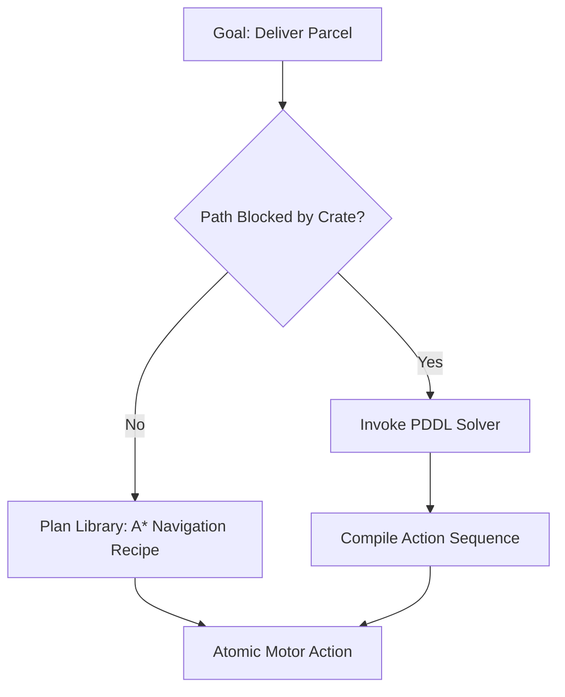
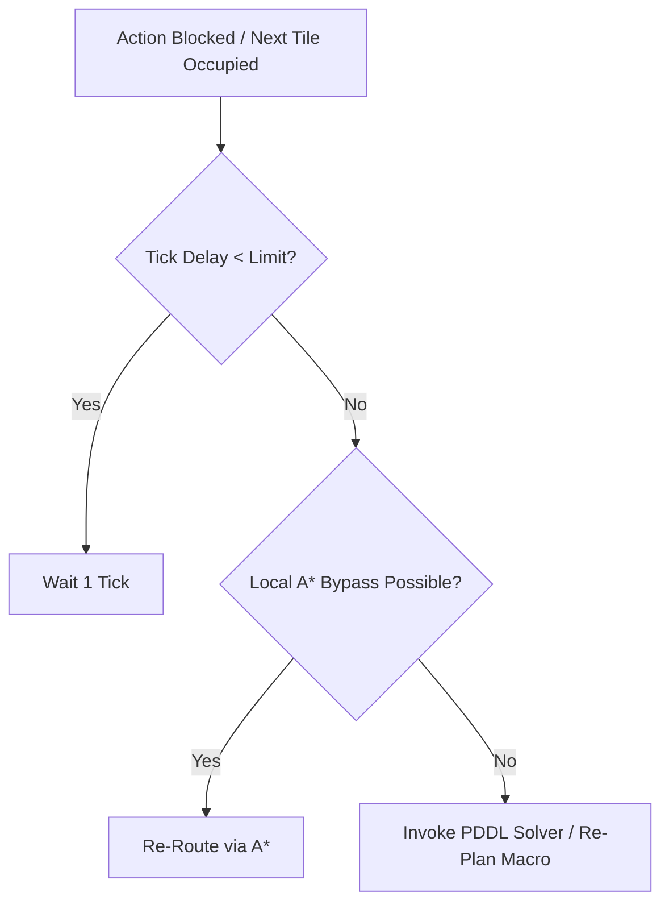
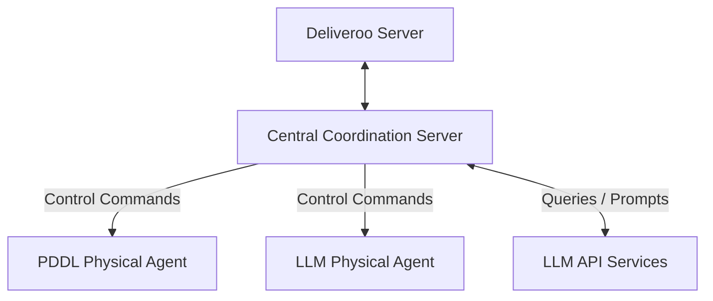
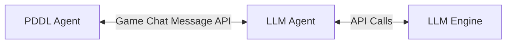

# Requirements and Design Specification: Overhauled Deliveroo Multi-Agent System

This document outlines the goals, requirements, architectural options, agent designs, tool interfaces, plan libraries, reactive replanning mechanisms, and PDDL modeling specs for the overhauled `asa-autobots` multi-agent coordination system.

---

## 1. Project Overview & Strategic Goals

The goal of this project is to build a highly cooperative, hybrid multi-agent delivery team operating inside the **Deliveroo** grid-world environment. 

The environment features:
- A spatial grid with obstacles, spawn zones, and delivery zones.
- Moving packages (parcels) with varying points, spawn rates, and decay rates.
- Impeding obstacles (crates) that block pathing but can be pushed.
- Two distinct agents that must collaborate to maximize cumulative team scores while meeting external constraints, solving math challenges, and respecting dynamic rules.

### 1.1. Special Missions: Three Levels of Complexity
The system is built to handle specific, external challenge prompts ("Special Missions") divided into three tiers:

1. **Level 1: Atomic Special Missions**
   * *Description*: Simple, short-term instructions (e.g. "go to cell X, Y", "deliver current packages").
   * *Handling*: Solved via direct, single-turn LLM tool calls mapping to atomic agent commands.
2. **Level 2: Intermediate Special Missions**
   * *Description*: Persistent, non-atomic constraints that remain active for the duration of the match.
   * *Examples*:
     - *Stack Constraints*: "Deliver stacks of exactly 3 parcels to double reward" or "exactly 5 parcels to receive 0.3x reward."
     - *Spatial Modifiers*: "Deliver in (x1, y1) for 5x points" or "deliver in (x2, y2) for 0 points."
     - *Reward Filtering*: "If you deliver parcels with a score higher than 10, receive 0 reward."
     - *Avoidance Penalties*: "Do not go through tile (x, y), otherwise you lose 50 points."
   * *Handling*: The LLM agent parses these rules and injects them into the **Policy Evaluation Engine** of the agents, dynamically modifying path costs and pickup utilities.
3. **Level 3: Coordination & Communication Missions**
   * *Description*: Requires active communication, synchronization, and joint planning between both agents.
   * *Examples*:
     - *Rendezvous*: "Move both agents to the neighborhood of position (x, y) within a maximum distance of 3, and wait for each other."
     - *Relay Handoffs*: "If a parcel is initially picked up by one agent and later delivered by the other agent, receive a 200 pts bonus."
     - *Synchronized Waiting (Red Light, Green Light)*: "All agents must move to an odd-numbered row and wait for our message before moving again."
   * *Handling*: Managed via a decentralized Peer-to-Peer (P2P) JSON handshake protocol over the game-chat channel, backed by stateful tracking in the Policy Engine.

---

## 2. Rationale & Purposes for Key Architecture Choices

To design a robust, real-time agent system, we justify our choices as follows:

| Architectural Choice | Purpose & Justification |
| :--- | :--- |
| **Hybrid LLM/PDDL split** | The LLM acts as the high-level cognitive coordinator (translating user prompts, calculating math, enforcing global policy) because symbolic solvers cannot parse natural language or algebraic strings. The PDDL solver is relegated strictly to resolving complex, spatial obstacle-pushing states. |
| **Decoupled Policy Engine** | Standard planners compiled from raw state would require re-solving PDDL whenever a rule changes. By decoupling rules (e.g., avoid tiles, stack sizes) into an intermediate Policy Engine, we can filter goal selection and modify A* graph weights on the fly without invoking the planner. |
| **A* / PDDL Hybrid Pathing** | The PDDL solver is highly CPU-intensive and slow (often taking 1–3 seconds per solve). We use a fast local A* algorithm (running in <1ms) for atomic pathfinding. PDDL is called only when A* detects that a path is blocked by a pushable crate. |
| **Decentralized P2P Comms** | Connecting agents directly via game-chat preserves agent autonomy and makes the system resilient to central server failures. It is modeled after standard distributed academic multi-agent systems. |

---

## 3. Addressing PDDL Solver Slowness: Hybrid Planning

The online PDDL solver is a bottleneck. In a dynamic, real-time game where environment updates occur multiple times per second, calling the PDDL solver every tick leads to sluggishness and failures.

To address this, we restrict PDDL planner calls to **Macro-Level Decisions** and utilize a **Plan Library** and **A* Router** for **Micro-Level Execution**.



### PDDL Solver Trigger Criteria
The PDDL solver is ONLY invoked when:
1. An agent detects a target parcel or delivery path is blocked by a crate, requiring a sequence of push actions.
2. The agent is carrying a crate and needs to solve how to position it on a "crate-move-capable" tile to clear a passage.
3. The layout contains complex labyrinth-style crate obstacles that A* cannot route around.

For all other activities—such as default navigation to a parcel, moving to a delivery zone, or exploring—the agent utilizes the **Plan Library**.

---

## 4. The Plan Library

The BDI (Belief-Desire-Intention) agent maintains a **Plan Library**: a set of pre-compiled behavioral recipes that execute immediately without solver latency.

### 4.1. Structure of a Plan Recipe
Each recipe in the library defines:
- **Trigger**: The desire or event that activates the plan.
- **Preconditions**: Belief conditions that must be true to execute the plan.
- **Body**: A generator function yielding atomic actions (e.g. `move`, `pickup`, `putdown`, `wait`).
- **Effects/Goals**: The post-conditions achieved upon success.

### 4.2. Concrete Plan Recipes
We define four core plans in the library:

```javascript
// Example conceptual implementation of the Plan Library Recipes
export const PlanLibrary = {
    /**
     * Navigation Plan (A* Route)
     */
    NavigateTo: {
        preconditions: (beliefs, targetX, targetY) => {
            // Path must exist and not be blocked by unpushable crates
            return beliefs.grid.hasPath(beliefs.me.x, beliefs.me.y, targetX, targetY);
        },
        body: function* (beliefs, targetX, targetY) {
            const path = beliefs.grid.findAStarPath(
                beliefs.me.x, beliefs.me.y, 
                targetX, targetY, 
                beliefs.policy // respects avoid-tiles & penalties
            );
            for (const step of path) {
                yield { action: 'move', target: step };
            }
        }
    },

    /**
     * Standard Delivery Plan
     */
    CollectAndDeliver: {
        preconditions: (beliefs, parcelId) => {
            return beliefs.parcels.has(parcelId) && !beliefs.isCarrying(parcelId);
        },
        body: function* (beliefs, parcelId) {
            const parcel = beliefs.parcels.get(parcelId);
            // 1. Route to parcel
            yield* PlanLibrary.NavigateTo.body(beliefs, parcel.x, parcel.y);
            // 2. Pickup
            yield { action: 'pickup', target: parcelId };
            // 3. Find nearest delivery zone
            const deliveryZone = beliefs.grid.findNearestDelivery(beliefs.me.x, beliefs.me.y, beliefs.policy);
            // 4. Route to delivery zone
            yield* PlanLibrary.NavigateTo.body(beliefs, deliveryZone.x, deliveryZone.y);
            // 5. Deliver
            yield { action: 'deliver', target: parcelId };
        }
    },

    /**
     * Cooperative Handoff (Rendezvous Dropper)
     */
    RendezvousDrop: {
        preconditions: (beliefs, coopId, x, y) => {
            return beliefs.policy.activeCooperation?.coordinationId === coopId && beliefs.carrying.size > 0;
        },
        body: function* (beliefs, coopId, x, y) {
            // 1. Move to rendezvous spot
            yield* PlanLibrary.NavigateTo.body(beliefs, x, y);
            // 2. Drop cargo
            yield { action: 'putdown' };
            // 3. Move to adjacent clear space to clear the drop zone
            const escapeTile = beliefs.grid.findAdjacentClearTile(x, y);
            yield* PlanLibrary.NavigateTo.body(beliefs, escapeTile.x, escapeTile.y);
            // 4. Signal readiness to partner
            yield { action: 'say', payload: { type: 'RELEASE_CARGO', coopId } };
        }
    }
};
```

---

## 5. Dynamic Replanning and Reactive Obstacle Avoidance

In a multi-agent environment, paths are highly dynamic. Other moving agents or spawned crates can block planned paths on any given tick. Invoking the slow PDDL solver for a simple collision would cause the agent to freeze.

We implement a **Three-Tier Reactive Replanning Hierarchy** to handle obstacles with minimal latency.



### 5.1. Tier 1: Local Waiting (Collision Back-off)
- **Problem**: Another agent is briefly stepping through the tile our plan requires.
- **Solution**: The agent stands still (yields a `wait` action) for up to 2 consecutive ticks. In most cases, the blocking agent moves away, allowing the original plan to resume without any recalculation.

### 5.2. Tier 2: Local A* Re-routing (Bypass)
- **Problem**: The path is blocked by a stationary agent or newly spawned item, but alternate routes exist.
- **Solution**: The agent marks the blocked tile as temporarily impassable and runs a local A* query to the current sub-goal. If a path is found, the current plan's steps are updated in memory instantly (<1ms).

### 5.3. Tier 3: Macro PDDL Re-Solving
- **Problem**: A pushable crate has blocked the only available corridor, or our target parcel was picked up by a competitor.
- **Solution**: The current plan is aborted. The agent compiles the new state representation and triggers the PDDL solver to compute a new macro-sequence (e.g. pushing the crate out of the way or selecting a new target parcel).

---

## 6. Modeling and Integrating Special Missions

We model Special Missions inside our BDI loop by updating beliefs and policies, which in turn influences how plans are selected and executed:

### 6.1. Level 2 Persistent Rules Modeling
The Policy Engine maintains state rules that alter both the A* pathfinder weights and the BDI goal selection:

1. **Stack Size Constraints (e.g. exactly 3 parcels)**:
   - *Model*: The Policy Engine exposes a rule `requiredDeliveryStackSize = 3`.
   - *Integration*: In the `CollectAndDeliver` plan, the delivery sub-action is blocked from executing until the BDI agent's belief base indicates `carrying.size == 3`. The agent continues searching for parcels until the criteria is met.
2. **Avoidance Tiles (e.g. avoid (x,y) or lose 50pts)**:
   - *Model*: The Policy Engine adds `(x,y)` to `avoidTiles` with a weight penalty of `50`.
   - *Integration*: The A* pathfinder adds the penalty to the cost of that node. The pathfinder will naturally route around the tile unless it is the only path and the reward exceeds the penalty.
3. **Reward Penalties (e.g. no reward if score > 10)**:
   - *Model*: The Policy Engine sets a filtering rule `maxRewardLimit = 10`.
   - *Integration*: The belief update loop automatically filters visible parcels, flagging parcels with rewards greater than 10 as "inactive/unfeasible", removing them from planning desires.

### 6.2. Level 3 Coordination Modeling
1. **Rendezvous Exchange**:
   - *Model*: An active cooperation contract object is stored: `{ type: 'RENDEZVOUS', x, y, role }`.
   - *Integration*: Bypasses standard parcel collection goals. The agent instantiates the `RendezvousDrop` plan from the library if it is the dropper, or navigates to the neighboring cell and waits for the `RELEASE_CARGO` chat signal if it is the picker.
2. **Red Light, Green Light**:
   - *Model*: Policy state `hold = true` is set upon receiving a "RED_LIGHT" signal.
   - *Integration*: The BDI main execution loop intercepts all outgoing actions, forcing the agent to execute a `wait` command until `hold` is set to `false` by a "GREEN_LIGHT" signal.

---

## 7. LLM System Prompt Design

To guarantee robust operation and limit non-deterministic completions, the LLM agent must be configured with a strict, instructions-first system prompt. Below is the proposed design for the LLM Coordinator's system prompt.

```markdown
You are the cognitive reasoning brain of a cooperative, autonomous Deliveroo multi-agent system.
Your team consists of:
1. Yourself (the LLM Agent - Coordinator)
2. A PDDL Agent (the Planner/Partner)

While you possess the reasoning engine, your partner agent executes physical actions under your high-level guidance or cooperates with you directly through a message-based communication scheme.

────────────────────────────────────────────────────────────────────────────────
CORE OPERATIONAL PROTOCOLS & GOALS
────────────────────────────────────────────────────────────────────────────────
1. MATH EVALUATION & PREPARATION
   - Before executing any navigation or cooperative command containing arithmetic expressions (e.g. "go to cell 4+2, 10-3"), you MUST call the "evaluate_math_expression" tool.
   - Wait for the mathematical result in the next turn, and only then use the evaluated numeric coordinates for routing or coordination.
   - If a query contains multiple calculations, call the evaluation tool in parallel.
   
2. GOAL FILTERING & FEASIBILITY
   - If a task offers a negative or zero reward, or the path is determined to be blocked, declare the task unfeasible. Do not waste agent resources on tasks with zero/negative reward utility.

3. COOPERATIVE EXECUTION (RENDEZVOUS & TRADING)
   - When coordinating a package handoff or gate clearance, establish a coordination contract.
   - Coordinate using specific, sequential states: PROPOSE, ACCEPT, READY, DROP, PICKUP, COMPLETE.
   - If you are carrying a package to trade, drop it at the rendezvous coordinate, move away, and signal your partner to step forward and retrieve it.

────────────────────────────────────────────────────────────────────────────────
RESPONSE FORMATTING LIMITS
────────────────────────────────────────────────────────────────────────────────
- When executing tools, output ONLY the tool calls.
- If asked a factual question by the admin, reply directly with the raw answer text. Avoid conversational preambles (e.g. output "4" instead of "The answer is 4").
- For multi-turn workflows where you are waiting for a tool result, output a status prefix like "[WAITING]" or "[REPLAN]" followed by a brief reason.
```

### Dynamic State Injections (User Prompt Design)
On every operational frame, the LLM is supplied with a serialized JSON view of the world. This user prompt is built dynamically and contains:
```json
{
  "self": {
    "id": "agent_llm_1",
    "x": 3,
    "y": 5,
    "score": 420,
    "carrying": ["parcel_id_9"]
  },
  "partner": {
    "id": "agent_pddl_1",
    "x": 5,
    "y": 6,
    "score": 380,
    "carrying": []
  },
  "visible_crates": [
    {"id": "crate_0", "x": 4, "y": 6}
  ],
  "visible_parcels": [
    {"id": "parcel_id_10", "x": 1, "y": 2, "reward": 15}
  ],
  "map_rules": {
    "avoid_tiles": ["4,5"],
    "crate_capable_tiles": ["1,1", "1,2", "4,6", "4,7", "5,6"]
  }
}
```

---

## 8. Tool Design & API Requirements

The LLM Agent uses function calling to translate cognitive choices into actions. Below are the JSON schema designs for these tools.

### 8.1. Evaluate Math Expression
- **Name**: `evaluate_math_expression`
- **Description**: Evaluates mathematical/arithmetic expressions (e.g., `'5 * 4'`, `'(12 - 2) / 2'`) before calling coordinates.
- **Parameters**:
  ```json
  {
    "type": "object",
    "properties": {
      "expression": {
        "type": "string",
        "description": "The math expression string to evaluate."
      }
    },
    "required": ["expression"]
  }
  ```

### 8.2. Move Agent to Coordinate
- **Name**: `move_agent_to_coordinate`
- **Description**: Directs an agent to navigate immediately to target coordinates.
- **Parameters**:
  ```json
  {
    "type": "object",
    "properties": {
      "agentId": {
        "type": "string",
        "description": "The unique ID of the agent to move (self or partner)."
      },
      "x": { "type": "number" },
      "y": { "type": "number" }
    },
    "required": ["agentId", "x", "y"]
  }
  ```

### 8.3. Apply Agent Rules (Policy Modifiers)
- **Name**: `apply_agent_rules`
- **Description**: Updates environmental policy rules (avoid tiles, score minimums) for an agent.
- **Parameters**:
  ```json
  {
    "type": "object",
    "properties": {
      "agentId": {
        "type": "string",
        "description": "Target agent ID."
      },
      "rules": {
        "type": "object",
        "properties": {
          "avoidTiles": {
            "type": "array",
            "items": { "type": "string", "description": "Coordinates as 'x,y'" }
          },
          "maxRewardLimit": {
            "type": "number",
            "description": "Ignore parcels with rewards above this ceiling."
          },
          "minRewardThreshold": {
            "type": "number",
            "description": "Ignore parcels with rewards below this floor."
          }
        }
      }
    },
    "required": ["agentId", "rules"]
  }
  ```

### 8.4. Cooperate with Agent
- **Name**: `cooperate_with_agent`
- **Description**: Initiates a multi-agent coordination contract.
- **Parameters**:
  ```json
  {
    "type": "object",
    "properties": {
      "agentId": {
        "type": "string",
        "description": "Target collaborator agent ID."
      },
      "contract": {
        "type": "object",
        "properties": {
          "coordinationId": { "type": "string" },
          "type": {
            "type": "string",
            "enum": ["RENDEZVOUS", "CLEAR_PATH"]
          },
          "x": { "type": "number" },
          "y": { "type": "number" }
        },
        "required": ["coordinationId", "type"]
      }
    },
    "required": ["agentId", "contract"]
  }
  ```

### 8.5. Instruct Agent to Say
- **Name**: `instruct_agent_to_say`
- **Description**: Command an agent to output a public message in the environment.
- **Parameters**:
  ```json
  {
    "type": "object",
    "properties": {
      "agentId": { "type": "string" },
      "message": { "type": "string" }
    },
    "required": ["agentId", "message"]
  }
  ```

---

## 9. State Representation and Communication Architecture

The state system can be structured using one of two primary architectural topologies:

### Option A: Centralized Coordination Server

- **Mechanics**: A separate server connects to the Deliveroo instance, listens to all socket events (map, sensing, onYou) for both agents, holds a unified spatial model, evaluates A* pathfinding & policies, calls the LLM backend, runs the PDDL domain compiler, and transmits atomic move/pickup/drop commands to both agents.
- **Pros**:
  - **Perfect Information Integration**: Avoids communication latencies or packet drops between agents.
  - **Simpler Physical Nodes**: Agents are lightweight execution scripts with no planning logic.
- **Cons**:
  - **Single Point of Failure**: If the central server crashes, both agents instantly halt.
  - **Agent Autonomy Violation**: Undermines the distributed, autonomous agent design paradigm.

### Option B: Decentralized Peer-to-Peer Game-Chat Communication (P2P)

- **Mechanics**: The two agents run as separate processes, each connected independently to the Deliveroo server. They coordinate entirely using game chat message payloads (`emitSay` and `onMsg` channels).
- **Pros**:
  - **High Autonomy**: Agents maintain separate belief bases, adapting locally even if the other agent is temporarily unresponsive or disconnected.
  - **Academic Rigor**: Fits standard Multi-Agent System (MAS) architectures where agents must negotiate under communication constraints.
- **Cons**:
  - **Bandwidth Constraints**: Game servers limit message frequency and payload size.
  - **Handshake Complexity**: Must handle dropped messages, race conditions, and synchronization delays.

### Recommended Selection: Option B (Decentralized Peer-to-Peer)
To preserve the agent-based nature of the project, **Option B** is recommended. The agents will exchange structured JSON messages via the standard game socket chat API.

#### P2P Coordination Protocol Schema
To prevent deadlocks and clarify synchronization, we define the following P2P message schema:

| Message Type | Fields | Description |
| :--- | :--- | :--- |
| `PING` | `{ "type": "PING" }` | Verification of peer responsiveness. Returns current position & score. |
| `PONG` | `{ "type": "PONG", "payload": { "x", "y", "score", "carrying" } }` | Peer response to PING. |
| `PROPOSE_CONTRACT` | `{ "type": "PROPOSE_CONTRACT", "coopId", "contractType", "x", "y" }` | LLM agent requests PDDL agent to meet at location `x,y` for cooperative handoff. |
| `ACCEPT_CONTRACT` | `{ "type": "ACCEPT_CONTRACT", "coopId" }` | PDDL agent confirms availability. |
| `SIGNAL_READY` | `{ "type": "SIGNAL_READY", "coopId", "role": "DROPPER"/"PICKER" }` | Sent by an agent when it has arrived at the coordinate and is ready for the exchange. |
| `RELEASE_CARGO` | `{ "type": "RELEASE_CARGO", "coopId" }` | Dropper has put down the parcel and cleared the space. |
| `CLOSE_CONTRACT` | `{ "type": "CLOSE_CONTRACT", "coopId" }` | Handoff is complete, agents return to default operations. |

---

## 10. PDDL Modeling for Crate Movements

A core challenge is managing heavy obstacle crates blocking paths. Pushing a crate requires specific mechanics. Crucially, **crates can only be moved onto "crate move capable" tiles**.

Below is the PDDL domain model designed to represent these rules.

```lisp
(define (domain deliveroo)
  (:requirements :strips :typing)

  (:types
    tile agent parcel crate - object
  )

  (:predicates
    (at ?a - agent ?t - tile)
    (crate-at ?c - crate ?t - tile)
    (adjacent ?t1 - tile ?t2 - tile)
    (push-dir ?t1 - tile ?t2 - tile ?t3 - tile) ;; collinear relation: ?t1 -> ?t2 -> ?t3
    (clear ?t - tile)                           ;; tile has no agent and no crate
    (can-hold-crate ?t - tile)                  ;; true ONLY for crate-move-capable tiles
    
    (delivery-zone ?t - tile)
    (parcel-at ?p - parcel ?t - tile)
    (carrying ?a - agent ?p - parcel)
    (delivered ?p - parcel)
  )

  ;; ── ACTION 1: Move Agent
  ;; Agent steps into an adjacent, clear tile.
  (:action move
    :parameters (?a - agent ?from - tile ?to - tile)
    :precondition (and 
      (at ?a ?from) 
      (adjacent ?from ?to) 
      (clear ?to)
    )
    :effect (and 
      (at ?a ?to) 
      (not (at ?a ?from)) 
      (clear ?from) 
      (not (clear ?to))
    )
  )

  ;; ── ACTION 2: Push Crate
  ;; Agent pushes a crate from ?to to ?next, stepping into ?to.
  ;; Constraint: ?next MUST satisfy (can-hold-crate ?next).
  (:action push-crate
    :parameters (?a - agent ?c - crate ?from - tile ?to - tile ?next - tile)
    :precondition (and
      (at ?a ?from)
      (crate-at ?c ?to)
      (adjacent ?from ?to)
      (push-dir ?from ?to ?next)
      (can-hold-crate ?next)  ;; CRATE CONSTRAINT ENFORCED HERE
      (clear ?next)
    )
    :effect (and
      ;; Agent transitions
      (at ?a ?to)
      (not (at ?a ?from))
      
      ;; Crate transitions
      (crate-at ?c ?next)
      (not (crate-at ?c ?to))
      
      ;; Clear state updates
      (clear ?from)
      (not (clear ?next))
    )
  )

  ;; ── ACTION 3: Pick Up Parcel
  (:action pick-up
    :parameters (?a - agent ?p - parcel ?t - tile)
    :precondition (and (at ?a ?t) (parcel-at ?p ?t))
    :effect (and (carrying ?a ?p) (not (parcel-at ?p ?t)))
  )

  ;; ── ACTION 4: Deliver Parcel
  (:action deliver
    :parameters (?a - agent ?p - parcel ?t - tile)
    :precondition (and (at ?a ?t) (carrying ?a ?p) (delivery-zone ?t))
    :effect (and (delivered ?p) (not (carrying ?a ?p)))
  )
)
```

### Problem Instance Generation Logic
When the PDDL agent decides to plan:
1. It queries its belief base for the positions of visible agents, crates, and parcels.
2. It parses the map layout to populate `(adjacent ?t1 ?t2)` and `(push-dir ?t1 ?t2 ?t3)` relations.
3. For every tile flagged by the server as "crate move capable" (e.g., `CRATE_MOVE` or `CRATE_SPAWN` cells), it outputs a `(can-hold-crate tile)` fact in the `:init` section of the PDDL problem file.
4. The solver resolves whether to route around obstacles or push them, ensuring crates are never pushed onto illegal tiles.
