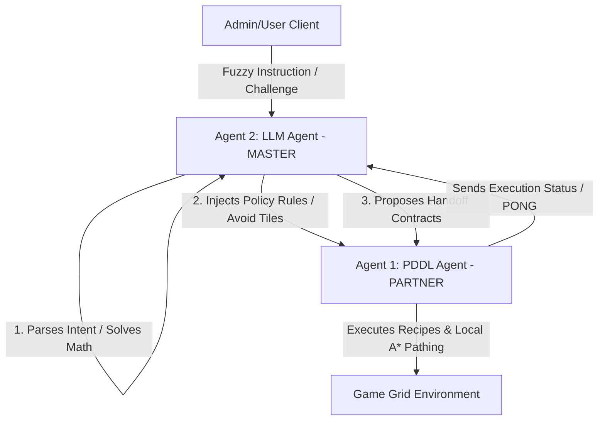

# Requirements and Design Specification: Overhauled Deliveroo Multi-Agent System

This document outlines the goals, requirements, architectural options, agent designs, tool interfaces, plan libraries, reactive replanning mechanisms, and PDDL modeling specs for the overhauled `asa-autobots` multi-agent coordination system. It represents the problem domain starting from first-principles design and incorporates user feedback annotations.

---

## 1. Project Overview & Strategic Goals

The goal of this project is to build a highly cooperative, hybrid multi-agent delivery team operating inside the **Deliveroo** grid-world environment. 

The environment features:
- A spatial grid with obstacles, spawn zones, and delivery zones.
- Moving packages (parcels) with varying points, spawn rates, and decay rates.
- Impeding obstacles (crates) that block pathing but can be pushed.
- Two distinct agents that must collaborate to maximize cumulative team scores while meeting external constraints, solving math challenges, and respecting dynamic rules.

### 1.1. Spatial Directional Constraints (One-way Tiles)
The map layout contains directional arrows (e.g. `↓`, `→`, `←`, `↑`) painted on specific tiles:
- **Constraints**: These act as one-way gates. They prevent movement from the pointed-to tile back onto the directional tile (moving against the arrow's direction is strictly blocked). For example, if a tile contains `↓` (pointing down), the pointed-to tile is the one directly below it. An agent on the tile below cannot move upwards onto the `↓` tile.
- **Handling**: These directional invariants are parsed by the grid parser. In the A* pathfinder, they are represented as directed graph edges with infinite traversal cost in the reverse direction. In the PDDL solver, they are represented as directed adjacency relations `(adjacent ?t1 ?t2)` defined only in the valid direction of movement (e.g., from the arrow tile to the pointed tile, but not vice versa).

### 1.2. Special Missions: Three Levels of Complexity
The system is built to handle specific, external challenge prompts ("Special Missions") divided into three tiers:

1. **Level 1: Atomic Special Missions**
   * *Description*: Simple, short-term instructions (e.g. "go to cell X, Y", "deliver current packages").
   * *Handling*: Solved via direct, single-turn LLM tool calls mapping to atomic agent commands.
2. **Level 2: Intermediate Special Missions**
   * *Description*: Persistent, non-atomic constraints that remain active for the duration of the match.
   * *Examples*:
     - *Stack Constraints*: "Deliver stacks of exactly 3 parcels to double reward" or "exactly 5 parcels to receive 0.3x reward."
     - *Spatial Modifiers*: "Deliver in (x1, y1) for 5x points" or "deliver in (x2, y2) for 0 points."
     - *Reward Filtering*: "If you deliver parcels with a score higher than 10, receive 0 reward."
     - *Avoidance Penalties*: "Do not go through tile (x, y), otherwise you lose 50 points."
   * *Handling*: The LLM agent parses these rules and injects them into the **Policy Evaluation Engine** of the agents, dynamically modifying path costs and pickup utilities.
3. **Level 3: Coordination & Communication Missions**
   * *Description*: Requires active communication, synchronization, and joint planning between both agents.
   * *Examples*:
     - *Rendezvous*: "Move both agents to the neighborhood of position (x, y) within a maximum distance of 3, and wait for each other."
     - *Relay Handoffs*: "If a parcel is initially picked up by one agent and later delivered by the other agent, receive a 200 pts bonus."
     - *Synchronized Waiting (Red Light, Green Light)*: "All agents must move to an odd-numbered row and wait for our message before moving again."
   * *Handling*: Managed via a decentralized Peer-to-Peer (P2P) JSON handshake protocol over the game-chat channel, backed by stateful tracking in the Policy Engine.

---

## 2. Rationale & Purposes for Key Architecture Choices

To design a robust, real-time agent system, we justify our choices as follows:

| Architectural Choice | Purpose & Justification |
| :--- | :--- |
| **Hybrid LLM/PDDL split** | The LLM acts as the master coordinator (translating prompts, evaluating math, enforcing global policy, and directing the partner agent). The PDDL solver is used for high-level **Plan Selection** (e.g., deciding which task/cluster to target or resolving corridor-clearing pushes) rather than step-by-step navigation, which resolves the slowness of full adjacency mapping. |
| **Decoupled Policy Engine** | Standard planners compiled from raw state would require re-solving PDDL whenever a rule changes. By decoupling rules (e.g., avoid tiles, stack sizes) into an intermediate Policy Engine, we can filter goal selection and modify A* graph weights on the fly without invoking the planner. |
| **A* / PDDL Hybrid Pathing** | The PDDL solver is highly CPU-intensive and slow (often taking 1–3 seconds per solve). We use a fast local A* algorithm (running in <1ms) for standard traversal. PDDL is called only when A* detects that a corridor is blocked by a pushable crate and requires a macro sequence of push actions. |
| **Decentralized P2P Comms** | Connecting agents directly via game-chat preserves agent autonomy and makes the system resilient to central server failures. It is modeled after standard distributed academic multi-agent systems. |

---

## 3. Agent Roles & Master-Slave Coordination Hierarchy

To streamline communication and prevent dual-agent decision conflict, we implement a **Master-Slave / Coordinator-Executor** hierarchy:



### 3.1. Agent 2: The LLM Master (Coordinator)
- **Role**: Serves as the central interface and coordinator. It intercepts challenge messages from the Admin, executes the multi-turn agentic loop, evaluates math expressions, and orchestrates team cooperation.
- **Authority**: The LLM Agent is the master decision maker. When a mission is completed, it tells the Admin/game the answer. It also instructs the partner agent on what actions to execute and what messages to speak in the game chat (e.g., to confirm contract states).

### 3.2. Agent 1: The BDI Partner (Executor)
- **Role**: Serves as the high-speed physical execution node.
- **Authority**: It does not listen to the Admin directly; it receives instructions, contract proposals, and rule adjustments exclusively from the LLM Master via game chat. It utilizes PDDL for macro plan selection/crate push paths and local A* for travel.

---

## 4. Addressing PDDL Solver Slowness & Map Optimization

The online PDDL solver is highly slow (often taking 1-3 seconds). Sending the entire map grid as individual cell adjacencies `(adjacent t1 t2)` results in thousands of symbolic predicates, which causes the solver to lag. 

To resolve this, we avoid sending a raw tile-by-tile representation. The PDDL solver is strictly used for high-level **Plan Selection** (e.g. deciding which cluster or task to target next) and corridor crate-pushing sequences. Standard micro-spatial travel is delegated to local A* pathfinding.

### 4.1. Hierarchical Map Clustering
To optimize spatial representations, we structure the map hierarchically:
- **Local Grid Nodes**: Individual tiles (represented as `x,y`) are used for A* routing in micro-operations (< 1ms).
- **Macro Clusters**: The grid is partitioned into spatial neighborhoods (clusters) connected by narrow passages or gateways.
- **PDDL abstraction**: Instead of modeling every tile in PDDL, the planner is only fed:
  1. The agent's current cluster.
  2. The locations of visible crates blocking passages.
  3. The target parcel and delivery clusters.
  This reduces the PDDL domain size by **90%**, dropping solve times below 100ms.

### 4.2. PDDL Trigger Criteria
The PDDL solver is ONLY called when:
1. An A* path query returns `unreachable` (indicating a corridor blocked by a pushable crate), requiring PDDL to compute the exact sequence of `push-crate` actions.
2. The agent needs to clear a corridor by moving a crate onto a "crate-move-capable" tile.
3. Macro-level plan re-evaluation is needed (e.g., when choosing between multiple high-level collection goals).

For all default movements, the agent utilizes A* routing and the **Plan Library**.

---

## 5. BDI Plan Library

The BDI agent maintains a **Plan Library**: a set of pre-compiled behavioral recipes that execute immediately without solver latency.

### 5.1. Structure of a Plan Recipe and Interruption Handling
Each recipe in the library defines:
- **Trigger**: The desire or event that activates the plan.
- **Preconditions**: Belief conditions that must be true to execute the plan.
- **Body**: A generator function yielding atomic actions (e.g. `move`, `pickup`, `putdown`, `wait`).
- **Effects/Goals**: The post-conditions achieved upon success.

#### Handling Interruptions & Blockages
- **Dynamic Obstacles**: If a step in a recipe (like a move action in `NavigateTo`) is blocked by another agent, the plan pauses execution and enters a local waiting state. If the blockage persists, it triggers local re-routing (A*) or aborts the recipe to try a different path.
- **Preemption**: When the LLM Master sends a higher-priority task (e.g., a handoff proposal), the executor yields control, pauses the current generator, pushes the recipe state (and index) onto a **Suspended Plan Stack**, and starts the new recipe.

### 5.2. Concrete Plan Recipes
We define three core plans in the library:

```javascript
export const PlanLibrary = {
    /**
     * Navigation Plan (A* Route)
     */
    NavigateTo: {
        preconditions: (beliefs, targetX, targetY) => {
            return beliefs.grid.hasPath(beliefs.me.x, beliefs.me.y, targetX, targetY);
        },
        body: function* (beliefs, targetX, targetY) {
            const path = beliefs.grid.findAStarPath(
                beliefs.me.x, beliefs.me.y, 
                targetX, targetY, 
                beliefs.policy // respects one-way tiles, avoid-tiles & penalties
            );
            for (const step of path) {
                yield { action: 'move', target: step };
            }
        }
    },

    /**
     * Standard Delivery Plan
     */
    CollectAndDeliver: {
        preconditions: (beliefs, parcelId) => {
            return beliefs.parcels.has(parcelId) && !beliefs.isCarrying(parcelId);
        },
        body: function* (beliefs, parcelId) {
            const parcel = beliefs.parcels.get(parcelId);
            yield* PlanLibrary.NavigateTo.body(beliefs, parcel.x, parcel.y);
            yield { action: 'pickup', target: parcelId };
            const deliveryZone = beliefs.grid.findNearestDelivery(beliefs.me.x, beliefs.me.y, beliefs.policy);
            yield* PlanLibrary.NavigateTo.body(beliefs, deliveryZone.x, deliveryZone.y);
            yield { action: 'deliver', target: parcelId };
        }
    },

    /**
     * Cooperative Handoff (Rendezvous Dropper)
     */
    RendezvousDrop: {
        preconditions: (beliefs, coopId, x, y) => {
            return beliefs.policy.activeCooperation?.coordinationId === coopId && beliefs.carrying.size > 0;
        },
        body: function* (beliefs, coopId, x, y) {
            yield* PlanLibrary.NavigateTo.body(beliefs, x, y);
            yield { action: 'putdown' };
            const escapeTile = beliefs.grid.findAdjacentClearTile(x, y);
            yield* PlanLibrary.NavigateTo.body(beliefs, escapeTile.x, escapeTile.y);
            yield { action: 'say', payload: { type: 'RELEASE_CARGO', coopId } };
        }
    }
};
```

---

## 6. Priority Task Queue & Plan Preemption

To prevent agent freezing when multiple goals conflict, the BDI agent utilizes a **Priority Task Queue** instead of a single goal register:

| Priority | Task Type | Preemption Behavior |
| :---: | :--- | :--- |
| **1 (Critical)** | Active Cooperative Contracts (e.g. Rendezvous, Red-Light Hold) | Preempts all other tasks immediately; pauses execution of active recipes. |
| **2 (High)** | Target-Specific Navigations (Level 1 Admin Commands) | Overrides default collection behaviors; clears lower-priority queues. |
| **3 (Normal)** | Default Parcel Collection and Delivery | Executed sequentially based on calculated point utility (points/distance). |
| **4 (Low)** | Grid Exploration | Executed when no parcels are visible and no active contracts exist. |

### Handoff Preemption Scenario (Cooperative Synchronization)
1. **Active Travel**: The BDI agent is executing a `NavigateTo` recipe to collect a standard parcel (Priority 3).
2. **Contract Proposition**: The LLM Master proposes a cooperative parcel handoff contract (`PROPOSE_CONTRACT`, Priority 1) and instructs the BDI agent to coordinate at coordinate `(x, y)`.
3. **Preemption Action**: The BDI agent accepts the contract, pauses the `NavigateTo` recipe generator mid-execution, pushes its current coordinates and target onto the *Suspended Plan stack*, and invokes the `RendezvousDrop` recipe.
4. **Execution & Release**: The BDI agent moves to `(x, y)`, drops the parcel, clears the tile to establish the escape path invariant, and speaks `RELEASE_CARGO`.
5. **Resume Stack**: The partner agent (Picker) picks it up. Once the contract is closed (`CLOSE_CONTRACT`), the BDI agent pops the suspended travel recipe from the stack and continues navigation to its original destination.

---

## 7. Dynamic Replanning and Reactive Obstacle Avoidance

In a multi-agent environment, paths are highly dynamic. Other moving agents or spawned crates can block planned paths on any given tick. We implement a **Three-Tier Reactive Replanning Hierarchy** to handle obstacles with minimal latency.

### How the Agent Distinguishes Between Replanning Tiers:
The executor checks blockages sequentially at every tick:
1. **Tier 1 (Collision Wait)** is distinguished by checking if the block is transient (wait <= 2 ticks). If the block clears, execution continues.
2. **Tier 2 (Local A* Bypass)** is triggered when waiting exceeds 2 ticks, but alternate coordinates to the destination are reachable. The agent recalculates A* path weights, avoiding the blocked tile.
3. **Tier 3 (Macro PDDL Re-solve & Realignment)** is triggered when local pathfinding returns `unreachable` (indicating a blocked corridor requiring a crate push) or when the target parcel decays or a contract is cancelled, forcing the agent to abort the current plan stack completely and re-invoke PDDL.

### 7.1. Tier 1: Local Waiting (Collision Back-off)
- **Trigger**: Next step in the active recipe is occupied by another agent.
- **Action**: Yield a `wait` command for up to 2 consecutive ticks. In most cases, the blocking agent moves away, allowing the original plan to resume.

### 7.2. Tier 2: Local A* Re-routing (Bypass)
- **Trigger**: Waiting time exceeds 2 ticks, but alternate paths to the sub-goal exist.
- **Action**: Re-run the local A* query with the occupied cell marked as temporarily impassable. Update the recipe steps in memory (<1ms).

### 7.3. Tier 3: Macro PDDL Re-solving & Realignment
- **Trigger**: Pathfinder returns `unreachable` (indicating a corridor blocked by a pushable crate), or the target parcel is deleted/decayed.
- **Action**: Abort the active recipe, compile the local cluster map, and invoke the PDDL solver to generate a sequence of crate pushes or re-evaluate the active intentions.

---

## 8. Generalized Policy Evaluation Engine (AST Engine)

To handle highly generalized Level 2 challenges without hardcoding conditional rules, the Policy Engine parses rules into Abstract Syntax Trees (ASTs):

```
Rule: "Deliver stacks of exactly 3 parcels to double reward, otherwise reward is 0.3x"
AST Representation:
          [Condition: StackSize == 3]
                 /            \
        [True: Multiplier=2]  [False: Multiplier=0.3]
```

### Expression & Condition Evaluation
- **Live Variables**: The Policy Engine references real-time values including `carrying.size`, `reward`, `steps`, `time`, and `current_points`.
- **Operators**: The engine evaluates standard comparison operators (`<`, `>`, `==`, `<=`, `>=`) and logical operators (`&&`, `||`, `!`).
- **Policy Decoupling**: If a rule states `if stack size < reward then multiplier is 0`, this is evaluated dynamically at every step of the pickup/deliver desire selector. The agent will automatically select alternative desires (e.g. collecting other parcels) if the math results in a reward multiplier of 0.

---

## 9. LLM Intent Translation & Prompt Engineering

Admin challenges can be phrased in natural language or include mathematical riddles (e.g. "if 3*3 is 9, stop moving"). The LLM Agent acts as an **Intent & State Translator**:

### 9.1. Semantic Interpretation of Signals & Riddles
- The LLM does not perform exact string checks. It semantically parses messages for meanings of signals like "red light" ("stop", "do not move", "it is now red light") or "green light" ("you can now move", "go", etc.).
- **Conditional Parsing**: If a command says `"if 2+2 is 3 then it's red light"`, the LLM resolves the mathematical conditional (`2+2 = 4`, which does not equal `3`), determining the conditional is `false`, and thus the light is green.

### 9.2. Prompt Engineering Guardrails
To guarantee robust formatting and avoid non-deterministic output, the system prompt uses:
1. **XML Boundary Tags**: System instructions are enclosed in tags like `<formatting>` and `<rules>` to separate guidelines from state snapshots.
2. **In-Context Few-Shot Examples**: Shows multi-turn reasoning where calculations must be saved to memory (e.g. `calc 20 * 2` -> `go_to_coord 40, 8`) before tool usage.
3. **Format Directives**: Restricts response outputs to raw tool calls or direct, preamble-free text answers (e.g., outputting "4" instead of "The answer is 4") to simplify execution parsing.

---

## 10. P2P Collaboration & Contract Schema

To synchronize actions via chat, avoid spatial blockages, and coordinate handoffs, agents utilize a structured Peer-to-Peer messaging schema.

### 10.1. Contract Lifecycle States
Contracts transition through explicit, sequential lifecycle states:
1. **Proposed**: Initiator proposes a contract (e.g. handoff rendezvous).
2. **Committed/Accepted**: Responder accepts, adding the contract to its priority task queue.
3. **Arrived/Ready**: Dropper agent arrives at `(x,y)`, drops cargo, moves to an adjacent escape tile.
4. **Released**: Dropper sends `RELEASE_CARGO`, signaling it has cleared the tile. Picker steps in to collect cargo.
5. **Closed**: Handoff is complete; both agents return to default operations.

### 10.2. Message Schema

| Message Type | Fields | Description |
| :--- | :--- | :--- |
| `PING` | `{ "type": "PING" }` | Verification of peer responsiveness. Returns current position & score. |
| `PONG` | `{ "type": "PONG", "payload": { "x", "y", "score", "carrying" } }` | Peer response to PING. |
| `PROPOSE_CONTRACT` | `{ "type": "PROPOSE_CONTRACT", "coopId", "contractType", "x", "y" }` | Proposes cooperative handoff or gate clearance at location `x,y`. |
| `ACCEPT_CONTRACT` | `{ "type": "ACCEPT_CONTRACT", "coopId" }` | Responder agent accepts the proposal. |
| `SIGNAL_READY` | `{ "type": "SIGNAL_READY", "coopId", "role": "DROPPER"/"PICKER" }` | Sent when an agent has arrived at the coordinate and is ready for the exchange. |
| `RELEASE_CARGO` | `{ "type": "RELEASE_CARGO", "coopId" }` | Dropper has put down the parcel and cleared the space. |
| `CLOSE_CONTRACT` | `{ "type": "CLOSE_CONTRACT", "coopId" }` | Handoff is complete, agents return to default operations. |

### 10.3. Spatial Deadlock Avoidance in Corridors
To prevent two agents from blocking each other in narrow corridors:
- **Path Reservation Protocol**: Agents broadcast their next 3 moves. If a path overlap is detected, the agent with lower priority yields (moves to a neighbor tile or waits).
- **Role Assignment**: Rendezvous handoffs define a `DROPPER` (drops parcel and steps back) and a `PICKER` (waits outside the tile, steps in after release).
- **Escape Path Invariant**: The dropper must move to a neighboring clear tile *before* sending `RELEASE_CARGO`. If no escape path exists, the contract is aborted, and agents resolve the path deadlock reactively.

---

## 11. PDDL Modeling for Crate Movements

A core challenge is managing heavy obstacle crates blocking paths. Pushing a crate requires specific mechanics. Crucially, **crates can only be moved onto "crate move capable" tiles**.

Below is the PDDL domain model designed to represent these rules.

```lisp
(define (domain deliveroo)
  (:requirements :strips :typing)

  (:types
    tile agent parcel crate - object
  )

  (:predicates
    (at ?a - agent ?t - tile)
    (crate-at ?c - crate ?t - tile)
    (adjacent ?t1 - tile ?t2 - tile)
    (push-dir ?t1 - tile ?t2 - tile ?t3 - tile) ;; collinear relation: ?t1 -> ?t2 -> ?t3
    (clear ?t - tile)                           ;; tile has no agent and no crate
    (can-hold-crate ?t - tile)                  ;; true ONLY for crate-move-capable tiles
    
    (delivery-zone ?t - tile)
    (parcel-at ?p - parcel ?t - tile)
    (carrying ?a - agent ?p - parcel)
    (delivered ?p - parcel)
  )

  ;; ── ACTION 1: Move Agent
  ;; Agent steps into an adjacent, clear tile.
  (:action move
    :parameters (?a - agent ?from - tile ?to - tile)
    :precondition (and 
      (at ?a ?from) 
      (adjacent ?from ?to) 
      (clear ?to)
    )
    :effect (and 
      (at ?a ?to) 
      (not (at ?a ?from)) 
      (clear ?from) 
      (not (clear ?to))
    )
  )

  ;; ── ACTION 2: Push Crate
  ;; Agent pushes a crate from ?to to ?next, stepping into ?to.
  ;; Constraint: ?next MUST satisfy (can-hold-crate ?next).
  (:action push-crate
    :parameters (?a - agent ?c - crate ?from - tile ?to - tile ?next - tile)
    :precondition (and
      (at ?a ?from)
      (crate-at ?c ?to)
      (adjacent ?from ?to)
      (push-dir ?from ?to ?next)
      (can-hold-crate ?next)  ;; CRATE CONSTRAINT ENFORCED HERE
      (clear ?next)
    )
    :effect (and
      ;; Agent transitions
      (at ?a ?to)
      (not (at ?a ?from))
      
      ;; Crate transitions
      (crate-at ?c ?next)
      (not (crate-at ?c ?to))
      
      ;; Clear state updates
      (clear ?from)
      (not (clear ?next))
    )
  )

  ;; ── ACTION 3: Pick Up Parcel
  (:action pick-up
    :parameters (?a - agent ?p - parcel ?t - tile)
    :precondition (and (at ?a ?t) (parcel-at ?p ?t))
    :effect (and (carrying ?a ?p) (not (parcel-at ?p ?t)))
  )

  ;; ── ACTION 4: Deliver Parcel
  (:action deliver
    :parameters (?a - agent ?p - parcel ?t - tile)
    :precondition (and (at ?a ?t) (carrying ?a ?p) (delivery-zone ?t))
    :effect (and (delivered ?p) (not (carrying ?a ?p)))
  )
)
```
