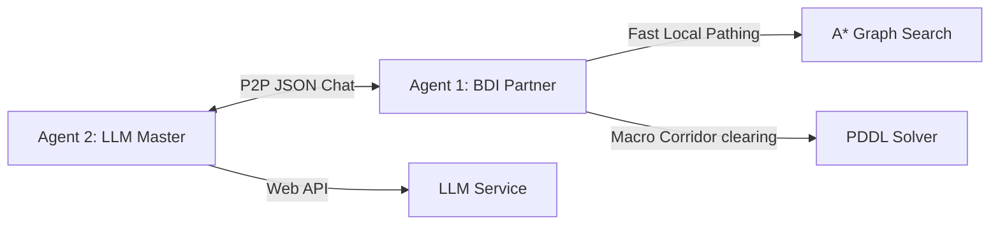

# Deliveroo Multi-Agent System: Core Specifications

This reference document compiles the complete system design, protocols, modeling structures, and prompt guardrails for the Deliveroo Multi-Agent System (MAS). It serves as the baseline for implementation tasks.

---

## 1. System Architecture

The team implements a decentralized Peer-to-Peer (P2P) coordinate framework operating over standard game socket chat logs.



### Roles and Authority
- **Agent 2 (LLM Master / Coordinator)**: Intercepts natural language and mathematical challenge prompts. Translates these challenges into active policy guidelines or rendezvous proposals. Commands the partner agent via game chat.
- **Agent 1 (BDI Executor / Partner)**: Focuses on physical movement. It maintains a priority task queue and checks plan library preconditions. It resolves navigation using A* and calls PDDL for push-crate actions in blocked hallways.

---

## 2. BDI Plan Library Recipes

Pre-compiled execution plans represented as generator functions:

### 2.1. NavigateTo
Routes an agent to coordinates while respecting active policy constraints (avoided cells, directional arrows).
```javascript
function* NavigateTo(beliefs, targetX, targetY) {
    const path = beliefs.grid.findAStarPath(
        beliefs.me.x, beliefs.me.y, targetX, targetY, beliefs.policy
    );
    for (const step of path) {
        yield { action: 'move', target: step };
    }
}
```

### 2.2. CollectAndDeliver
Navigates to pick up a parcel and delivers it to the nearest valid delivery zone.
```javascript
function* CollectAndDeliver(beliefs, parcelId) {
    const parcel = beliefs.parcels.get(parcelId);
    yield* NavigateTo(beliefs, parcel.x, parcel.y);
    yield { action: 'pickup', target: parcelId };
    const zone = beliefs.grid.findNearestDelivery(beliefs.me.x, beliefs.me.y, beliefs.policy);
    yield* NavigateTo(beliefs, zone.x, zone.y);
    yield { action: 'deliver', target: parcelId };
}
```

### 2.3. RendezvousDrop
Navigates to a target, drops the parcel, backs off to a neighboring clear tile to establish an escape path, and speaks `RELEASE_CARGO`.
```javascript
function* RendezvousDrop(beliefs, coopId, x, y) {
    yield* NavigateTo(beliefs, x, y);
    yield { action: 'putdown' };
    const escape = beliefs.grid.findAdjacentClearTile(x, y);
    yield* NavigateTo(beliefs, escape.x, escape.y);
    yield { action: 'say', payload: { type: 'RELEASE_CARGO', coopId } };
}
```

---

## 3. P2P Message Schema

Messages are serialized JSON strings sent over the standard game chat.

| Message Type | JSON Payload | Description / Usage |
| :--- | :--- | :--- |
| `PING` | `{"type": "PING"}` | Heartbeat verification. |
| `PONG` | `{"type": "PONG", "payload": {"x", "y", "score"}}` | Status response containing coordinates. |
| `PROPOSE_CONTRACT` | `{"type": "PROPOSE_CONTRACT", "coopId", "type", "x", "y"}` | Proposes a handoff or corridor clearing task. |
| `ACCEPT_CONTRACT` | `{"type": "ACCEPT_CONTRACT", "coopId"}` | Executor accepts contract and suspends current actions. |
| `SIGNAL_READY` | `{"type": "SIGNAL_READY", "coopId", "role"}` | Sent when dropper or picker arrives at coordinates. |
| `RELEASE_CARGO` | `{"type": "RELEASE_CARGO", "coopId"}` | Dropper has cleared the tile; Picker may step forward. |
| `CLOSE_CONTRACT` | `{"type": "CLOSE_CONTRACT", "coopId"}` | Handoff complete; returns both to standard queues. |
| `LOCK_TARGET` | `{"type": "LOCK_TARGET", "targetId"}` | Target parcel lock to prevent duplicate pathing. |
| `RELEASE_TARGET` | `{"type": "RELEASE_TARGET", "targetId"}` | Releases a locked target. |

---

## 4. AST Policy Rules Schema

Level 2 challenge restrictions are applied to Agent 1 via the tool call `apply_agent_rules(agentId, rules)`:
```json
{
  "avoidTiles": ["x,y"],
  "maxRewardLimit": 100,
  "minRewardThreshold": 5,
  "requiredStackSize": 3,
  "multiplierRules": [
    { "condition": "carrying.size == 3", "multiplier": 2.0 }
  ],
  "bonusRules": [
    { "condition": "x == 2 && y == 3", "bonus": 100 }
  ]
}
```

---

## 5. PDDL Modeling (Corridor Clearing)

Crate movements are strictly restricted: **crates can only be moved onto "crate move capable" tiles** (e.g. `CRATE_MOVE` and `CRATE_SPAWN` cells).

### 5.1. Predicates
- `(adjacent t1 t2)`: Directed adjacency pathing (respects one-way arrows).
- `(push-dir t1 t2 t3)`: Collinear push relation.
- `(can-hold-crate t)`: True only for crate-capable tiles.
- `(clear t)`: Tile is unoccupied by agents or crates.

### 5.2. Core Actions
- `move(?a - agent, ?from - tile, ?to - tile)`
- `push-crate(?a - agent, ?c - crate, ?from - tile, ?to - tile, ?next - tile)`: Enforces `(can-hold-crate ?next)`.

---

## 6. LLM Coordinator Prompt Structure

The coordinator relies on formatting constraints and XML tag isolation:

### 6.1. System Instructions
- Mandates Chain-of-Thought (CoT) reasoning before emitting tool calls.
- Enforces strict arithmetic resolution via `evaluate_math_expression` first.
- Requires raw, preamble-free replies for direct questions.
- Enforces single, sequential tool calls per turn (parallel tool calling is strictly prohibited).

### 6.2. Coordinator Tool Manifest
- `evaluate_math_expression(expression)`
- `move_agent_to_coordinate(agentId, x, y)`
- `apply_agent_rules(agentId, rules)`
- `cooperate_with_agent(agentId, contract)`
- `instruct_agent_to_say(agentId, message)`
