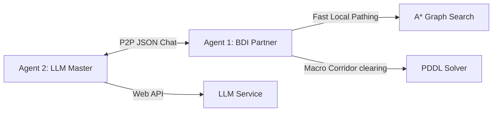

<main class="main-panel">
<header style="display: flex; justify-content: space-between; align-items: flex-start; border-bottom: 1px solid var(--border-color); padding-bottom: 1.5rem; margin-bottom: 3rem;">

System Specifications

<h1>📋 Deliveroo Multi-Agent System: Core Specifications</h1>

Complete system design, protocols, modeling structures, and prompt guardrails.

<button class="btn btn-secondary" onclick="clearAllComments()" style="font-size:0.75rem; border-color: rgba(239, 68, 68, 0.2); color: #ef4444; background: rgba(239, 68, 68, 0.05);">🧹 Clear Annotations</button>

</header>

This reference document compiles the complete system design, protocols, modeling structures, and prompt guardrails for the Deliveroo Multi-Agent System (MAS). It serves as the baseline for implementation tasks.

<!-- 1. System Architecture -->
<section id="system-architecture">

1

<h2>System Architecture</h2>

The team implements a decentralized Peer-to-Peer (P2P) coordinate framework operating over standard game socket chat logs.

<h3>Roles and Authority</h3>
<ul>
<li class="commentable" data-comment-id="role-master"><strong>Agent 2 (LLM Master / Coordinator)</strong>: Intercepts natural language and mathematical challenge prompts. Translates these challenges into active policy guidelines or rendezvous proposals. Commands the partner agent via game chat.</li>
<li class="commentable" data-comment-id="role-partner"><strong>Agent 1 (BDI Executor / Partner)</strong>: Focuses on physical movement. It maintains a priority task queue and checks plan library preconditions. It resolves navigation using A* and calls PDDL for push-crate actions in blocked hallways.</li>
</ul>
</section>

<!-- 2. BDI Plan Library Recipes -->
<section id="bdi-plan-library">

2

<h2>BDI Plan Library Recipes</h2>

Pre-compiled execution plans represented as generator functions:

<h3>2.1. NavigateTo</h3>

Routes an agent to coordinates while respecting active policy constraints (avoided cells) and Manhattan distance radius.

<pre><code class="language-javascript">export function* NavigateTo(beliefs, targetX, targetY, radius = 0) {
    // 1. Round coordinates and clamp within map boundaries.
    // 2. If already within radius of target on a walkable tile, return true.
    // 3. Find walkable candidates within radius, select best target.
    // 4. Calculate A* path using findAStarPath (respecting policyRules and crates).
    // 5. Yield move actions sequentially, recalculating path if displaced or blocked.
    const path = findAStarPath(beliefs.map, beliefs.me, target, beliefs.policyRules, beliefs);
    for (const step of path) {
        yield { action: 'move', target: step };
    }
}</code></pre>

<h3>2.2. CollectAndDeliver</h3>

Navigates to pick up a parcel.

<pre><code class="language-javascript">export function* CollectAndDeliver(beliefs, parcelId) {
    const parcel = beliefs.parcels.get(parcelId);
    if (!parcel) return;
    const reached = yield* NavigateTo(beliefs, parcel.x, parcel.y);
    if (!reached) return;
    yield { action: 'pickup', target: parcelId };
}</code></pre>

<h3>2.3. RendezvousDrop</h3>

Navigates to a target, drops the parcel, backs off to a neighboring clear tile to establish an escape path, and speaks <code>RELEASE_CARGO</code>.

<pre><code class="language-javascript">export function* RendezvousDrop(beliefs, coopId, x, y) {
    const reached = yield* NavigateTo(beliefs, x, y);
    if (!reached) return;
    yield { action: 'putdown' };
    const escape = findAdjacentClearTile(beliefs, x, y);
    yield* NavigateTo(beliefs, escape.x, escape.y);
    yield { action: 'say', payload: { type: 'RELEASE_CARGO', coopId } };
}</code></pre>

<h3>2.4. Intention Engine & Macro Goals</h3>

Complex coordination behaviors are managed at a higher level as intention cases inside <code>Intentions.js</code>. For example:
<ul>
  <li><code>handoff</code>: Directs the dropper to navigate to the handoff zone, drop cargo, step aside to clear space, wait for peer ready, and retrieve swapped cargo.</li>
  <li><code>patrol</code> / <code>patrol_spawn</code>: Drives the agent to scan and travel between distant spawn zones to discover new parcels.</li>
  <li><code>clear_corridor</code>: Triggers the PDDL crate-pushing solver to clear blocked hallways.</li>
</ul>

</section>

<!-- 3. P2P Message Schema -->
<section id="p2p-message-schema">

3

<h2>P2P Message Schema</h2>

Messages are serialized JSON strings sent over the standard game chat.

<table>
<thead>
<tr>
<th>Message Type</th>
<th>JSON Payload</th>
<th>Description / Usage</th>
</tr>
</thead>
<tbody>
<tr class="commentable" data-comment-id="msg-ping">
<td><code>PING</code></td>
<td><code>{"type": "PING"}</code></td>
<td>Heartbeat verification.</td>
</tr>
<tr class="commentable" data-comment-id="msg-pong">
<td><code>PONG</code></td>
<td><code>{"type": "PONG", "payload": {"name", "x", "y", "score"}}</code></td>
<td>Status response containing coordinates and score.</td>
</tr>
<tr class="commentable" data-comment-id="msg-peer-status">
<td><code>PEER_STATUS</code></td>
<td><code>{"type": "PEER_STATUS", "payload": { "name", "x", "y", "score", "nextStep", "path", "carried", "currentGoal", "crates" }}</code></td>
<td>Sends full spatial, intent, carried inventory, and visible crate positions to the partner.</td>
</tr>
<tr class="commentable" data-comment-id="msg-sync-req">
<td><code>SYNC_REQ</code></td>
<td><code>{"type": "SYNC_REQ"}</code></td>
<td>Request to synchronize initial state.</td>
</tr>
<tr class="commentable" data-comment-id="msg-sync-ack">
<td><code>SYNC_ACK</code></td>
<td><code>{"type": "SYNC_ACK"}</code></td>
<td>Acknowledge synchronization request.</td>
</tr>
<tr class="commentable" data-comment-id="msg-lock">
<td><code>LOCK_TARGET</code></td>
<td><code>{"type": "LOCK_TARGET", "targetId"}</code></td>
<td>Claims a lock on a parcel target to avoid redundant pickup runs.</td>
</tr>
<tr class="commentable" data-comment-id="msg-release-target">
<td><code>RELEASE_TARGET</code></td>
<td><code>{"type": "RELEASE_TARGET", "targetId"}</code></td>
<td>Releases a target lock when parcel is lost or delivered.</td>
</tr>
<tr class="commentable" data-comment-id="msg-propose">
<td><code>PROPOSE_CONTRACT</code></td>
<td><code>{"type": "PROPOSE_CONTRACT", "coopId", "contractType", "x", "y", "radius", "holdDuration", "courierId"}</code></td>
<td>Proposes a coordination contract (RENDEZVOUS, HANDOFF, RELAY, CLEARING) at coordinates.</td>
</tr>
<tr class="commentable" data-comment-id="msg-accept">
<td><code>ACCEPT_CONTRACT</code></td>
<td><code>{"type": "ACCEPT_CONTRACT", "coopId"}</code></td>
<td>Confirms acceptance of proposed contract.</td>
</tr>
<tr class="commentable" data-comment-id="msg-ready">
<td><code>SIGNAL_READY</code></td>
<td><code>{"type": "SIGNAL_READY", "coopId"}</code></td>
<td>Signals that the agent has arrived at the coordinate and is ready for the contract step.</td>
</tr>
<tr class="commentable" data-comment-id="msg-release">
<td><code>RELEASE_CARGO</code></td>
<td><code>{"type": "RELEASE_CARGO", "coopId"}</code></td>
<td>Signals that cargo has been dropped and the peer can step forward to pick it up.</td>
</tr>
<tr class="commentable" data-comment-id="msg-close">
<td><code>CLOSE_CONTRACT</code></td>
<td><code>{"type": "CLOSE_CONTRACT", "coopId"}</code></td>
<td>Closes the cooperation contract, resuming normal agent loops.</td>
</tr>
<tr class="commentable" data-comment-id="msg-apply-rules">
<td><code>APPLY_RULES</code></td>
<td><code>{"type": "APPLY_RULES", "rules"}</code></td>
<td>Updates the partner agent's belief base with new policy rules.</td>
</tr>
<tr class="commentable" data-comment-id="msg-move-to">
<td><code>MOVE_TO</code></td>
<td><code>{"type": "MOVE_TO", "x", "y", "holdOnArrival", "holdDuration", "dropOnArrival"}</code></td>
<td>Directs partner movement to coordinates.</td>
</tr>
<tr class="commentable" data-comment-id="msg-move-to-ack">
<td><code>MOVE_TO_ACK</code></td>
<td><code>{"type": "MOVE_TO_ACK", "success", "x", "y"}</code></td>
<td>Acknowledge movement completion status.</td>
</tr>
<tr class="commentable" data-comment-id="msg-hold">
<td><code>HOLD</code></td>
<td><code>{"type": "HOLD"}</code></td>
<td>Pauses the physical agent.</td>
</tr>
<tr class="commentable" data-comment-id="msg-resume">
<td><code>RESUME</code></td>
<td><code>{"type": "RESUME"}</code></td>
<td>Resumes the physical agent and clears active coordination contracts.</td>
</tr>
<tr class="commentable" data-comment-id="msg-instruct-say">
<td><code>INSTRUCT_SAY</code></td>
<td><code>{"type": "INSTRUCT_SAY", "message"}</code></td>
<td>Instructs the agent to say a public chat message.</td>
</tr>
<tr class="commentable" data-comment-id="msg-set-variable">
<td><code>SET_VARIABLE</code></td>
<td><code>{"type": "SET_VARIABLE", "name", "value"}</code></td>
<td>Sets a variable inside the partner agent memory.</td>
</tr>
</tbody>
</table>
</section>

<!-- 4. Policy Engine Rules & Evaluation -->
<section id="ast-policy-rules">

4

<h2>Policy Engine Rules & Evaluation</h2>

 <h3>4.1. General Evaluation Engine Identifiers</h3>
 

 Level 2/3 challenge restrictions are evaluated by checking mathematical/logical condition expressions at every tick. Standard variables resolved against agent beliefs:
 

 <ul>
 <li><code>x</code>, <code>y</code>: Current agent coordinate.</li>
 <li><code>score</code>: Current agent score.</li>
 <li><code>carrying.size</code> / <code>stack_size</code>: Current carried inventory size.</li>
 <li><code>parcel.id</code>, <code>parcel.reward</code>, <code>parcel.x</code>, <code>parcel.y</code>, <code>parcel.carriedBy</code>: Candidate/carried parcel properties.</li>
 <li><code>parcel.previouslyCarriedByOther</code>: Evaluates to true if another agent has carried the parcel.</li>
 <li><code>path.traverses_X_Y</code>: Evaluates to true if the planned path traverses tile (X, Y).</li>
 </ul>
 
 <h3>4.2. Policy Rules JSON Structure</h3>
 

 Rules are sent as an array of objects to <code>apply_agent_rules</code>. The engine supports two primary rule styles which can be used individually or combined:
 

 
 <h4>1. Bounds-Based Rules</h4>
 
Rules specifying explicit physical coordinate lists, carried stack size limits, and parcel reward boundaries to automatically scale or add bonuses to deliveries:

 <pre><code class="language-json">[
  {
    "all_tiles": false,
    "tiles": ["2,3", "2,4"],
    "stackSizeBounds": [
      { "min": 3, "max": null }
    ],
    "rewardBounds": [
      { "min": 10, "max": 100 }
    ],
    "multiplier": 0.5,
    "bonus": 100
  }
]</code></pre>

 <h4>2. Expression & Rule Arrays (Shunting-Yard Evaluated)</h4>
 
Rules evaluated dynamically on each tick using the Shunting-Yard expression evaluator. These support conditional checks on live variables and nested rule definitions:

 <pre><code class="language-json">[
  {
    "all_tiles": true,
    "condition": "carrying.size >= 3 && score < 200",
    "multiplierRules": [
      { "condition": "parcel.previouslyCarriedByOther == true", "multiplier": 0.5 }
    ],
    "bonusRules": [
      { "condition": "x == 2 && y == 3", "bonus": -50 }
    ]
  }
]</code></pre>

 <h3>4.3. Rule Enforcements & Wait-to-Decay Mechanics</h3>
 

 Active policy rules received by the agent are processed cumulatively. The agent recalculates the parameters (e.g. <code>minRewardThreshold</code>, <code>maxRewardLimit</code>, <code>requiredStackSize</code>, <code>maxStackSize</code>, and <code>avoidTiles</code>) over all active policy rules, avoiding previous constraints from being overwritten.
 

  <ul>
  <li><strong>Tile Avoidance Parsing</strong>: Any rule specifying coordinates with a negative bonus (<code>bonus < 0</code>) or a penalty multiplier (<code>multiplier < 1</code>) is automatically classified as an avoidance rule. The target tile is injected into the BDI pathfinder's avoidance set.</li>
  <li><strong>Optimal Stack Delivery Optimizer (DeliveryOptimizer.js)</strong>: Instead of greedily evaluating parcels, the BDI agent runs a subset-optimization algorithm (<code>optimizeDeliveryStack</code>) at arrival. This algorithm evaluates all subsets of carried cargo at candidate wait times $t$ to maximize the total policy-adjusted reward, supporting stack size bounds (e.g. exactly 3 parcels) and wait-to-decay ranges. The evaluator passes a cloned parcel object with the decayed reward property to <code>evaluatePolicyReward</code>, ensuring constraints are evaluated correctly on the projected decayed value.</li>
  <li><strong>Sanity & Bounded Complexity Checks</strong>:
    <ul>
      <li><em>Adaptive Subsetting</em>: If carrying $N \le 6$ parcels, does a full power set evaluation ($2^N \le 64$ subsets). If $N > 6$, it prunes the search to relevant stack boundaries (e.g. bounds from rules, required stack size), individually positive cargo, and the full cargo set, ensuring $O(N \log N)$ complexity.</li>
      <li><em>Conditional Decay Scanning</em>: If policy rules contain no reward-based constraints, wait time is immediately set to 0. If constraints exist, decay scanning automatically extracts boundaries $b$ (from <code>rewardBounds</code>, <code>maxRewardLimit</code>, and <code>minRewardThreshold</code>) and evaluates decay wait times $t$ that bring the parcel value to exactly $b$, $b - 1$, and $b - 0.1$, guaranteeing that decay steps are targeted and never missed.</li>
    </ul>
  </li>
  <li><strong>Togglable Logs</strong>: All optimization, worthiness checking, and subset generation logging is prefix-intercepted and togglable via the <code>LOG_OPTIMIZER</code> environment variable (mapped to <code>LOGGER_CONFIG.enableOptimizer</code>), allowing fine-grained logging control.</li>
  <li><strong>Delivery Step-aside and Discard Execution</strong>: If the optimal subset has a positive reward and there are discarded cargo elements (e.g., storing/discarding excess cargo to satisfy stack rules or avoiding penalties), the agent steps to an adjacent non-delivery tile to drop the discarded subset first, returns to the delivery zone, yields the optimal wait time, and drops all remaining cargo in a single action. If no subset achieves a positive reward, the agent discards all carried cargo on an adjacent tile to avoid penalties.</li>
  </ul>
</section>

<!-- 5. PDDL Modeling (Corridor Clearing) -->
<section id="pddl-modeling">

5

<h2>PDDL Modeling (Corridor Clearing)</h2>

Crate movements are strictly restricted: <strong>crates can only be moved onto "crate move capable" tiles</strong> (e.g. <code>CRATE_MOVE</code> and <code>CRATE_SPAWN</code> cells).

<h3>5.1. Predicates</h3>
<ul>
<li class="commentable" data-comment-id="pred-adj"><code>(adjacent t1 t2)</code>: Directed adjacency pathing (respects one-way arrows).</li>
<li class="commentable" data-comment-id="pred-push"><code>(push-dir t1 t2 t3)</code>: Collinear push relation.</li>
<li class="commentable" data-comment-id="pred-hold"><code>(can-hold-crate t)</code>: True only for crate-capable tiles.</li>
<li class="commentable" data-comment-id="pred-clear"><code>(clear t)</code>: Tile is unoccupied by agents or crates.</li>
</ul>

<h3>5.2. Core Actions</h3>
<ul>
<li class="commentable" data-comment-id="act-move"><code>move(?a - agent, ?from - tile, ?to - tile)</code></li>
<li class="commentable" data-comment-id="act-push"><code>push-crate(?a - agent, ?c - crate, ?from - tile, ?to - tile, ?next - tile)</code>: Enforces <code>(can-hold-crate ?next)</code>.</li>
</ul>
</section>

<!-- 6. LLM Coordinator Prompt Structure -->
<section id="llm-coordinator-prompt">

6

<h2>LLM Coordinator Prompt Structure</h2>

The coordinator relies on formatting constraints and XML tag isolation:

<h3>6.1. System Instructions</h3>
<ul>
<li class="commentable" data-comment-id="sys-cot">Mandates Chain-of-Thought (CoT) reasoning before emitting tool calls.</li>
<li class="commentable" data-comment-id="sys-math">Enforces strict arithmetic resolution via <code>evaluate_math_expression</code> first.</li>
<li class="commentable" data-comment-id="sys-preamble">Requires raw, preamble-free replies for direct questions.</li>
<li class="commentable" data-comment-id="sys-sequential">Enforces single, sequential tool calls per turn (parallel tool calling is strictly prohibited).</li>
</ul>

<h3>6.2. Coordinator Tool Manifest</h3>
<ul>
<li class="commentable" data-comment-id="tool-history"><code>get_history()</code></li>
<li class="commentable" data-comment-id="tool-math"><code>evaluate_math_expression(expression)</code></li>
<li class="commentable" data-comment-id="tool-move"><code>move_agent_to_coordinate(id, x, y, holdOnArrival, holdDuration, dropOnArrival)</code></li>
<li class="commentable" data-comment-id="tool-rules"><code>apply_agent_rules(id, rules)</code></li>
<li class="commentable" data-comment-id="tool-coop"><code>cooperate_with_agent(id, contract)</code></li>
<li class="commentable" data-comment-id="tool-context"><code>get_local_context()</code></li>
<li class="commentable" data-comment-id="tool-variable"><code>set_agent_variable(id, name, value)</code></li>
<li class="commentable" data-comment-id="tool-hold"><code>hold_agent(id, duration)</code></li>
<li class="commentable" data-comment-id="tool-resume"><code>resume_agent(id)</code></li>
</ul>
</section>
</main>
